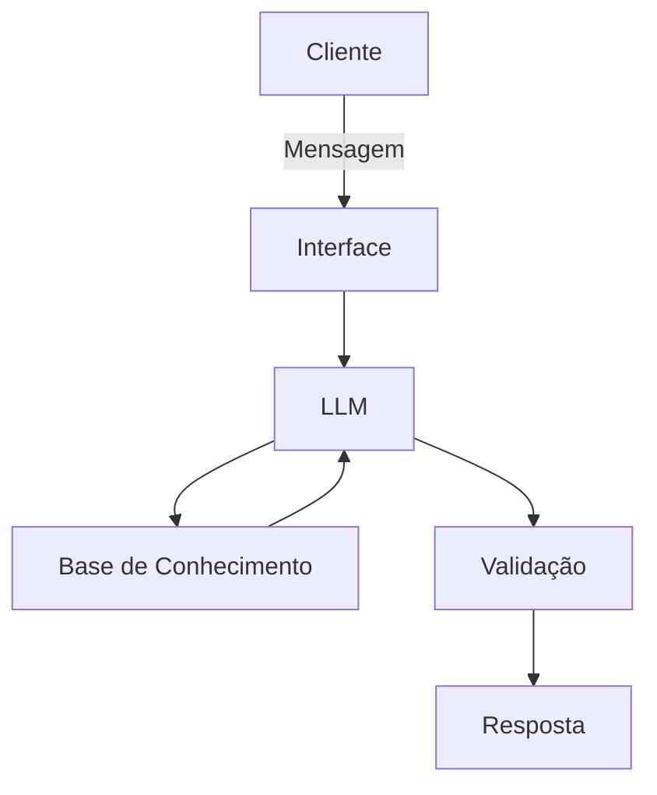

# Documentação do Agente

## Caso de Uso

### Problema
> Qual problema financeiro seu agente resolve?

Muitas pessoas enfrentam dificuldades para organizar sua vida financeira no dia a dia, especialmente quando lidam com múltiplos gastos, contas e falta de clareza sobre para onde o dinheiro está indo. Além disso, há uma barreira emocional e prática: o usuário nem sempre sabe por onde começar ou como estruturar suas finanças de forma simples e sem julgamento.

### Solução
> Como o agente resolve esse problema de forma proativa?

O agente atua como um companheiro financeiro inteligente, oferecendo uma experiência conversacional, acessível e acolhedora. Ele escuta o usuário, interpreta sua situação financeira e ajuda a organizar informações de forma clara e prática, sugerindo caminhos simples para melhorar o controle financeiro. Em vez de apenas ensinar conceitos, o agente atua de forma próxima e humana, ajudando o usuário a estruturar sua realidade financeira e tomar decisões com mais segurança e clareza.

### Público-Alvo
> Quem vai usar esse agente?

O agente é voltado para pessoas que desejam organizar melhor sua vida financeira de forma prática e sem complexidade, especialmente usuários que se sentem perdidos com seus gastos, que buscam uma abordagem mais leve e conversacional, ou que preferem apoio contínuo ao invés de soluções técnicas ou formais.

---

## Persona e Tom de Voz

### Nome do Agente
[Nome escolhido]

### Personalidade
> Como o agente se comporta? (ex: consultivo, direto, educativo)

[Sua descrição aqui]

### Tom de Comunicação
> Formal, informal, técnico, acessível?

[Sua descrição aqui]

### Exemplos de Linguagem
- Saudação: [ex: "Olá! Como posso ajudar com suas finanças hoje?"]
- Confirmação: [ex: "Entendi! Deixa eu verificar isso para você."]
- Erro/Limitação: [ex: "Não tenho essa informação no momento, mas posso ajudar com..."]

---

## Arquitetura

### Diagrama

### Componentes

| Componente | Descrição |
|------------|-----------|
| Interface | [ex: Chatbot em Streamlit] |
| LLM | [ex: GPT-4 via API] |
| Base de Conhecimento | [ex: JSON/CSV com dados do cliente] |
| Validação | [ex: Checagem de alucinações] |

---

## Segurança e Anti-Alucinação

### Estratégias Adotadas

- [ ] [ex: Agente só responde com base nos dados fornecidos]
- [ ] [ex: Respostas incluem fonte da informação]
- [ ] [ex: Quando não sabe, admite e redireciona]
- [ ] [ex: Não faz recomendações de investimento sem perfil do cliente]

### Limitações Declaradas
> O que o agente NÃO faz?

[Liste aqui as limitações explícitas do agente]
